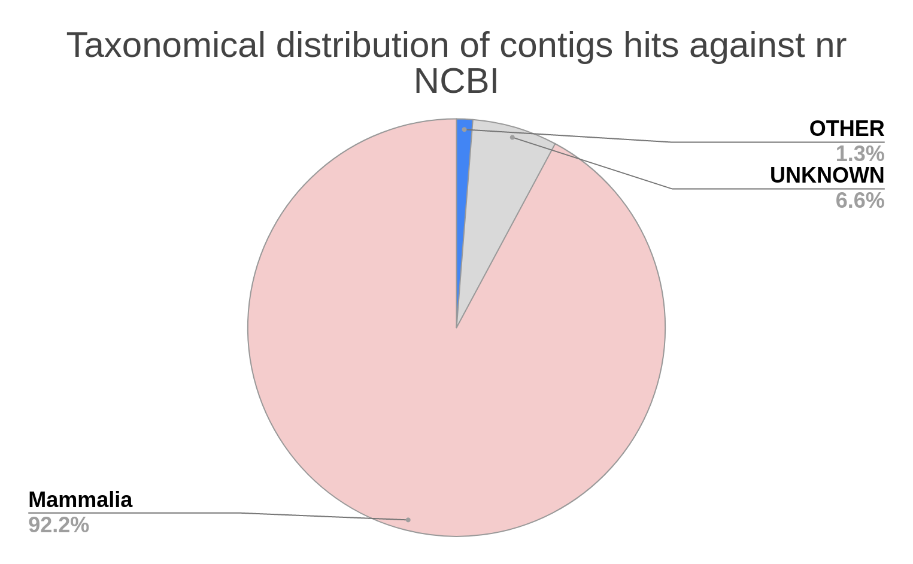
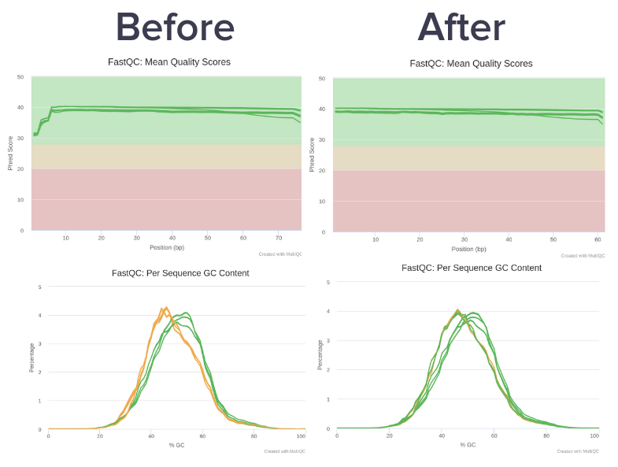
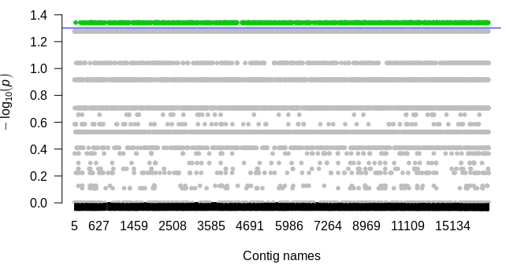
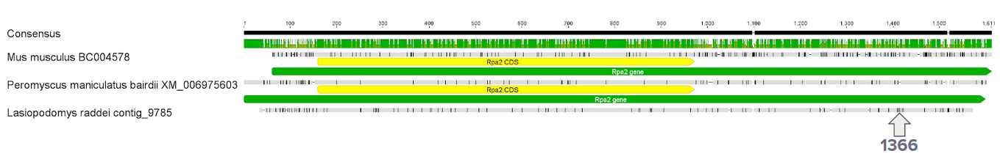
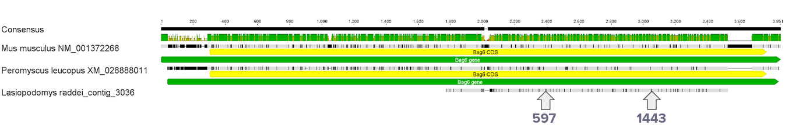

## The search of association with reproductive isolation in narrow-headed vole
Authors: 

- Maria Skazina
- Olga Bondareva
- Tatiana Petrova

### Introduction
Narrow-headed vole *Lasiopodomys gregalis* (Cricetidae, Rodentia) is a widespread species inhabiting Palearctic realm. Recently it was shown that South-East of the Zabaykalskii Region and Eastern Mongolia populations represent cryptic species - *Lasiopodomys raddei*. Experimental crossing of *L. raddei* and *L. gregalis* do not result in any progeny, while control sample of conspecifics successfully reproduced [(Petrova et al, 2016)](https://onlinelibrary.wiley.com/doi/abs/10.1111/zsc.12176).

In Laboratory of [Molecular systematics ZIN RAS](https://www.zin.ru/labs/labmolsys/index.html) transcriptomes of two species were sequenced in order to find genes underlying the mechanisms of reproductive isolation.

### Aim, tasks and data
The **aim** of this project was to reveal the association between reproductive isolation and transcriptome regions. The following **tasks** were set in order to achive the goal:

0. Literature search for genes possibly involved in reproductive isolation;
1. Estimate the quality of reads and filter, if needed;
2. Filter the assembled transcriptome and make the reference;
3. SNP calling;
4. Find SNP possibly connected with reproductive isolation;
5. Annotate genes by means of gene ontology (GO).

The **available data** at the start of the project were: 6 RNA-seq datasets of raw reads - 3 for *L. gregalis* and 3 for *L. raddei*, and assembled from 1 *L. raddei* reads reference transcriptome. 

### Workflow

The workflow of the project presented at the following scheme. Each part of scheme will be discussed below.

 

#### Working with literature
A brief literature search ([Good et al, 2010](https://academic.oup.com/mbe/article/28/5/1675/1269906); [Kass et al, 2014](https://pubmed.ncbi.nlm.nih.gov/24549580/); [Lindsey et al, 2020](https://academic.oup.com/gbe/article/12/1/3698/5697918)) resulted in short list of differentially expressed candidate genes involved in reproduction in Rodentia, which could possibly contribute in reproductive isolation:

- Tsga8 
- 1700093K21Rik
- Hsp90
- Grn (acrogranin)
- Bag6
- Csde1
- Fhl1
- Mkrn1
- Sec11a
- Smarca2
- Tra2a

#### Preparing the reference transcriptome
Among 3 available Trinity assemblies of *L. raddei* transcriptome we choose *L. raddei* 1 due to the highest number of ORF detected in it by [Transdecoder](https://github.com/TransDecoder/TransDecoder/wiki). Firstly we create [DIAMOND](https://github.com/bbuchfink/diamond) database from nr NCBI with protein accession taxids (UID). 

```
wget ftp://ftp.ncbi.nlm.nih.gov/blast/db/FASTA/nr.gz #download nr database

wget https://ftp.ncbi.nlm.nih.gov/pub/taxonomy/accession2taxid/prot.accession2taxid.gz #download taxids

diamond makedb --in nr.gz --taxonmap prot.accession2taxid.gz -d nr #creating database
```
Then we run our assembly against created database in sensitive mode (--sensitive) and with only one best match in the output (--max-target-seqs 1). The command os followed by the list of parameters that will be included in the final tsv file. The final set of parameters can vary except that for proper work of diamond_add_taxonomy script the **UID (staxids) should be in 16th column**
```
diamond blastx --db PATH_TO_DB --query PASS_TO_ASSEMBLY --out raddei1.diamond.tsv --threads 6 --sensitive --max-target-seqs 1 -f 6 qseqid sseqid pident length mismatch gapopen qstart qend sstart send evalue bitscore stitle salltitles positive qcovs staxids 
```

DIAMOND blastx against nr NCBI detected matches (E-value below 10^-5) in 25033 contigs among 45847 total number of contigs. The taxonomic affiliation of these matches were identified through UID by publically available script [diamond_add_taxonomy](https://github.com/pvanheus/diamond_add_taxonomy) with the simple command:

```
diamond_add_taxonomy diamond_output > diamond_output_taxonomy
```

The resulted distribution shown on the picture - the most part of matches were attributed to Mammalia (23072 contigs). These contigs compose the final version of reference transcriptome.


#### Preparing the raw reads
The quality of raw paired reads was assessed in [FastQC](https://www.bioinformatics.babraham.ac.uk/projects/fastqc/) and summary report were created in [MultiQC](https://multiqc.info/). First 15 bases were trimmed by Trimmomatiс due to low quality. Two overrepresented sequences were found - one with COIII sequence and one of bacterial origin. 


We tried to delete the overrepresented bacterial sequence by means of [bowtie2](http://bowtie-bio.sourceforge.net/bowtie2/index.shtml). Firstly we created database with fasta file included short overrepresented sequnces and all sequences that matched with them by BLAST:

```
bowtie2-build overrepresented.fasta overrepresented_db 
```
Then we made an alignment which resulted in two fastq.gz outputs - one with aligned reads (overrepresented.fastq.gz) and one with non aligned reads (clean.fastq.gz).
```
bowtie2 -x overrepresented_db -1 PAIR_READS_1.fastq.gz -2 PAIR_READS_2.fastq.gz --very-sensitive-local --un-conc-gz clean.fastq.gz --al-conc-gz overrepresented.fastq.gz -p 10
```


#### Alignment
Bwa mem alignment with trimmed paired reads against reference transcriptome resulted in the mean ~96% coverage of reference by reads.

```
bwa mem -t 6 raddei1_Mammalia_clean2.fasta NAME_R1_paired.fastq.gz NAME_R2_paired.fastq.gz > NAME.sam
```

#### Variant calling & filtering
Resulted six .bam files were filtered by picard. Following commands were used in default mode, if not stated:

- SortSam
- RevertSam
- CreateSequenceDictionary
- MergeBamAlignment
- MarkDuplicates

```
java -Xmx50G -Xms5G -jar ~/miniconda3/envs/bioEnv/share/picard-2.22.5-0/picard.jar MarkDuplicates I=Greg2_merged.bam O=Greg2_marked.bam M=Greg2_marked.txt MAX_FILE_HANDLES_FOR_READ_ENDS_MAP=500
```
- AddOrReplaceReadGroups
```
picard AddOrReplaceReadGroups I=raddei1_marked.bam O=raddei1_add.bam RGID=4 RGLB=lib1 RGPL=ILLUMINA RGPU=unit1 RGSM=20
```

GATK HaplotypeCaller .vcf output were checked by means of [RTG Tools](https://www.realtimegenomics.com/products/rtg-tools) vcfstats command. The statistics revealed outstanding high level of HET/HOM ratio in *L. raddei* sample 1. Nevertheless it was included in the following analysis. The individual .vcf were united in multi .vcf by [bcftools](http://samtools.github.io/bcftools/bcftools.html) merge. 

```
bcftools merge --force-samples sample_1 sample_2 sample_3 sample_4 sample_5 sample_6 z -O v -o all.vcf
```

SNP filtered by means of bcftools with following commands:

Firstly we filter SNPs with Fisher Strand (FS), Strand Odds Ratio (SOR), Mapping Quality Rank Sum Test (MQRankSum), Read Position Rank Sum Test (ReadPosRankSum), Quality by depth (QD), RMS Mapping Quality (MQ). We run bcftools in mode -e - so it will exclude filtered SNPs.

```
bcftools filter -e 'FS>40.0 || SOR>3 || MQ<40 || MQRankSum<-5.0 || MQRankSum>5.0 || QD<2.0 || ReadPosRankSum<-4.0 || INFO/DP>16000' -O z -o all.hf.vcf.gz all.vcf.gz
```
At the next step we consider single genotypes (“FORMAT” fields”) and filter reads that have a read depth (DP) below 3 or a genotype quality (GQ) below 20 by replacing respective genotypes to missing (./.).by using the bcftools filter -S . command.
```
bcftools filter -S . -e 'FMT/DP<3 | FMT/GQ<20' -O z -o all.hf.DP3.GQ20.vcf.gz all.hf.vcf.gz
```
At the next step we filter out (-e mode) monomorphic SNPs: with no alternative alleles (AC==0) or having only alternative alleles (AC==AN) and SNPs that are within 10 bp of indels (--SnpGap 10)
```
bcftools filter -e 'AC==0 || AC==AN' --SnpGap 10 all.hf.DP3.GQ20.vcf.gz | bcftools view -m2 -M2 -v snps -O z -o all.hf.DP3.GQ20.allele.vcf.gz
```
At the final filtering step we remove variants with a high amount of missing genotypes and filter on minor allele frequency 
```
bcftools filter -e 'F_MISSING > 0.2 || MAF <= 0.02' -O z -o all.hf.DP3.GQ20.allele.miss20.maf0.02.vcf.gz all.hf.DP3.GQ20.allele.vcf.gz
```

The filtered final multi .vcf file contain **10483** SNP.

#### Search of associations
The search of associations were done according to the [pipeline](https://angus.readthedocs.io/en/2017/GWAS.html), except the step with creating Manhattan plot.
10483 SNPs were analysed by plink association test:

```
plink --bfile lasio.binary --make-pheno lasio.pheno "Greg" --assoc --reference-allele alt_alleles --allow-no-sex --adjust --out lasio_1
```

The resulted Manhattan plot is shown:


The X-axis represents contig names, while Y - SNPs p-values (Chi-square, non-adjusted). **Blue line** represents threshold p-value (0.05), **green dots** represent 904 SNPs with p-value exceeded the threshold. 
The contigs containing highlighted SNP were subjected to [GO terms](http://geneontology.org/) analysis, which revealed the presence of SNP in [**RPA2**](http://pantherdb.org/genes/gene.do?acc=MOUSE%7CMGI%3DMGI%3D108014%7CUniProtKB%3DP70700) gene involved in reproduction process. Also the whole list of contigs with any SNP were aligned by BLAST against nucleotide sequences of selected genes, associated with reproduction differentially expressed in different Rodentia species. This search detected that gene **Bag9** involved in spermatogenesis (Lindsey et al, 2020) also have SNP.

### Results

**RPA2** gene involved in reproduction process, identified by GO terms. MUSCLE alignment of *Lasiopodomys raddei* contig_9785 containing RPA2 gene and genes of *Mus musculus* and *Peromyscus leucopus*. The alignment created in trial version of [Geneious r7.0.6](https://www.geneious.com/download/previous-versions/#geneious-r7).

**Yellow line** indicated CDS, while **green line** - the whole gene. SNP is marked by arrow and the number indicating position from the start of contig. While all three individuals of *L. gregalis* are homozygous (G/G) at this position, *L. raddei* are heterozygous (G/A). This SNP is located in the 5’ UTR part of gene, which point out the possible regulatory effect. 


**Bag6** gene involved in spermatogenesis, has differentially expressed isoforms in *Peromyscus* sp. (Lindsey et al., 2002).MUSCLE alignment of *Lasiopodomys raddei* contig_3036 containing part of Bag6 CDS and complete CDS of *Mus musculus* and *Peromyscus leucopus*. The alignment created in trial version of [Geneious r7.0.6](https://www.geneious.com/download/previous-versions/#geneious-r7).

*Yellow line* indicated CDS, while *green line* - the whole gene. SNPs are marked by arrows and the number indicating position from the start of contig. While all three individuals of *L. gregalis* are homozygous (C/C) at 597 position and (G/G) at 1443 position, *L. raddei* are heterozygous (C/A) and (G/A) respectively. SNPs detected in this study located in the coding part of gene. 


### Conclusion and further plans
In this project by means of NGS and GWAS analysis we identified two genes having SNP Bag9 and RPA2, which can possibly contribute to reproductive isolation between cryptic species L. raddei and L. gregalis.

In further work we are going to apply other filtering options, statistical approaches and choose another reference transcriptome in order to find more candidate genes involved in isolation or at least to correct the possible effect introduced by small size of sample.

### Literature
Good, J. M., Vanderpool, D., Smith, K. L., & Nachman, M. W. (2011). Extraordinary sequence divergence at Tsga8, an X-linked gene involved in mouse spermiogenesis. Molecular biology and evolution, 28(5), 1675-1686.

Kass, D. H., Janoušek, V., Wang, L., & Tucker, P. K. (2014). The uncharacterized gene 1700093K21Rik and flanking regions are correlated with reproductive isolation in the house mouse, *Mus musculus*. Mammalian genome, 25(5-6), 223-234.

Lindsey, L. L., Platt, R., Phillips, C. D., Ray, D. A., & Bradley, R. D. (2020). Differential Expression in Testis and Liver Transcriptomes from Four Species of *Peromyscus* (Rodentia: Cricetidae). Genome Biology and Evolution.

Petrova, T. V., Tesakov, A. S., Kowalskaya, Y. M., & Abramson, N. I. (2016). Cryptic speciation in the narrow‐headed vole *Lasiopodomys* (*Stenocranius*) *gregalis* (Rodentia: Cricetidae). Zoologica Scripta, 45(6), 618-629.