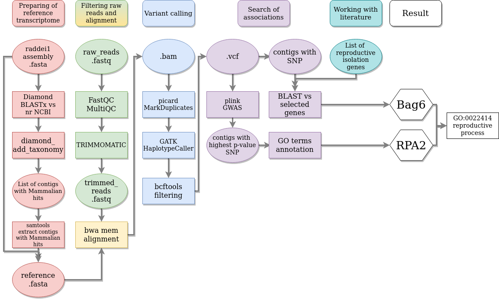

## The search of association with reproductive isolation in narrow-headed vole

### Introduction
Narrow-headed vole *Lasiopodomys gregalis* (Cricetidae, Rodentia) is a widespread species inhabiting Palearctic realm. Recently it was shown that South-East of the Zabaykalskii Region and Eastern Mongolia populations represent cryptic species - *Lasiopodomys raddei*. Experimental crossing of *L. raddei* and *L. gregalis* do not result in any progeny, while control sample of conspecifics successfully reproduced (Petrova et al., 2016).

In Laboratory of [Molecular systematics ZIN RAS](https://www.zin.ru/labs/labmolsys/index.html) transcriptomes of two species were sequenced in order to find genes underlying the mechanisms of reproductive isolation.

### Aim, tasks and data
The **aim** of this project was to reveal the association between reproductive isolation and transcriptome regions. The following **tasks** were set in order to achive the goal:

0. Literature search for genes possibly involved in reproductive isolation;
1. Estimate the quality of reads by FastQC and filter, if needed;
2. Filter the assembled transcriptome and make the reference;
3. SNP calling;
4. Find SNP possibly connected with reproductive isolation;
5. Annotate genes by means of gene ontology (GO).

The **available data** at the start of the project were: 6 RNA-seq datasets of raw reads - 3 for *L. gregalis* and 3 for *L. raddei*, and assembled from 1 *L. raddei* reads reference transcriptome. 

### Workflow

The workflow of the project presented at the following scheme. Each part of scheme will be discussed below.

 

#### Working with literature

#### Preparing of reference transcriptome

#### Preparing the raw reads

#### Alignment

#### Variant calling & filtering

#### Search of associations

### Results

### Further plans

